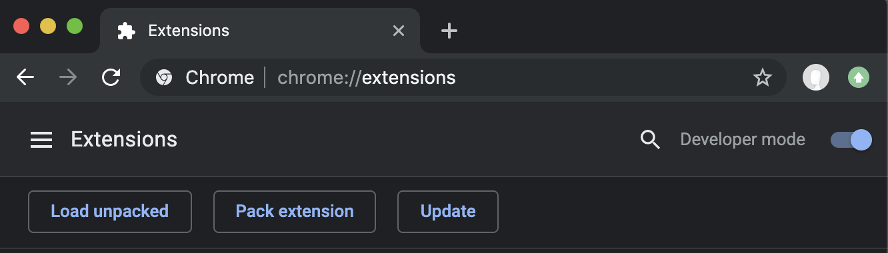

# nLightning Mind chrome extension

Chrome extension that is helping you focus.

There are so many annoying websites and there are tools 

It should be painful enough to build the habit of not visiting naughty websites.

Couple hundred satoshis per second, can customise depending on your goals.

I believe that flowing animation and ticking timer will stress you out and rewire your brain.

Ever since I’ve seen Andreas talk about Lightning Network and satoshis per second I thought it’s freaking revolutionary...


# Demo


### Installation

Lightning network is unfairly cheap. Now it is unfairly easy to run your own node:
https://medium.com/lightning-power-users/windows-macos-lightning-network-284bd5034340


Visiting that URL is important
https://127.0.0.1:8081/v1/getinfo
In that way you click accept the certificate


Clone or download the repo

[chrome://extensions/](chrome://extensions/)

Developer Mode
Load Unpacked



### Flow of the app
1. `manifest.json` injecting `my-script-injecting-iframe.js`
2. Checking if the website is on the black list


### Profit


### Where does the profit go?
Sorry not sorry, shameless plug, a meaningful (effective altruism, exponential technologies) project initiated by me: https://genesis.re/wiki/#Plan_B


### File structure
It all started from a minimal chrome extension. The most important files marked with ⚡️:

```
├── background.jpg
├── background.js
├── bitcoin-small.png
├── iframed.css                    ⚡️
├── iframed.html                   ⚡️
├── iframed.js                     ⚡️
├── images
│   ├── get_started128.png
│   ├── get_started16.png
│   ├── get_started32.png
│   └── get_started48.png
├── jquery.js
├── manifest.json
├── my-script-injecting-iframe.js  ⚡️
├── normalize.css
├── not-a-fraud.jpg
├── options.html
├── options.js
├── popup.css                      ⚡️
├── popup.html                     ⚡️
├── popup.js                       ⚡️
├── readme-images
│   ├── activity.gif
│   ├── bitcoin-games-logo.png
│   └── developer-mode.png
├── readme.md
├── reset.css
├── styles.css
└── zepto.min.js
```


### TODO:

* less happy path

There are so many potential onboarding pains

* save for later

Rationale:

Just by visiting the website and writing down what you want to accomplish is enough to realise it's not necessary

Batching requests


* Keep track of completed tasks

Rationale

In case of social media and sending message to someone, you may want periodically follow up


* Amazon affiliate, rewrting links 

Extra income, extra money


### Acknowledgements

Pierre Rochard
Caleb from Radar Tech
João from OpenNode
閃電網絡工程師 大哥保羅 from LND Developer Slack