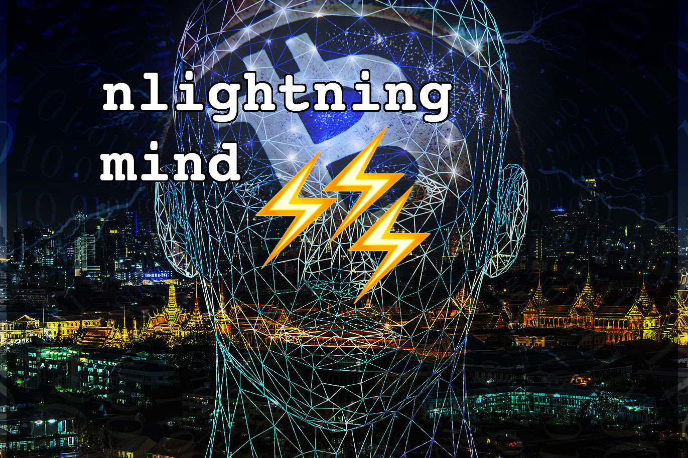

# nlightning mind ⚡️️️️⚡️⚡️

Chrome extension that helps you focus.

There are so many annoying websites and there are tools that block them. But what if you really need to do something on Instagram?

I believe that flowing animation and ticking timer will stress you enough and rewire your brain. It should be painful enough so that you build the habit of not visiting distracting websites.

Ever since I’ve seen Andreas talk about Lightning Network and `sat` per second I thought it’s freaking revolutionary...

# Demo

### https://youtu.be/aiX317rw4SE

[](https://youtu.be/aiX317rw4SE)


**Caveat:** Even though I wanted to pay `sat` per second, sometimes it took a little bit longer and decided to settle for a micropayment every 5 seconds. 

# Installation

1. Node Launcher
Lightning network is unfairly cheap. Now it is unfairly easy to run your own node:
https://medium.com/lightning-power-users/windows-macos-lightning-network-284bd5034340

*(this is requirement, without your node it will not fly)*

2. `https://` OK, you need to visit that URL https://127.0.0.1:8081/v1/getinfo and accept

3. Signup for https://www.opennode.co and create your API key

4. Clone or download the repo

5. Go to `chrome://extensions/` + Developer Mode + Load Unpacked


6. In the extension setting upload `admin.macaroon`


# Flow of the app
1. `manifest.json` injecting `my-script-injecting-iframe.js`
2. Checking if the website is on the black list, if no then nothing happens
3. If yes, diplay a full screen overflay - what do you want to accomplish?
4. A small iframe floating on top
5. Every second create an invoice ([code](https://github.com/genesisdotre/Bitcoin-Games-nLightning-Mind-Chrome-Extension/blob/954d9473567f0b805744e7f299e219a6f148d966/iframed.js#L103)) and send lightning payment ([code](https://github.com/genesisdotre/Bitcoin-Games-nLightning-Mind-Chrome-Extension/blob/954d9473567f0b805744e7f299e219a6f148d966/iframed.js#L122))


6. When job done, close the tab
7. When you run out of time you'll suffer...

# File structure
It all started from a minimal chrome extension. The most important files marked with ⚡️️⚡️⚡️️

```
├── background.jpg
├── background.js
├── bitcoin-small.png
├── iframed.css                    ⚡️️⚡️⚡️️
├── iframed.html                   ⚡️️⚡️⚡️️
├── iframed.js                     ⚡️️⚡️⚡️️
├── images
│   ├── ...
├── jquery.js
├── manifest.json                  ⚡️️⚡️⚡️️
├── my-script-injecting-iframe.js  ⚡️️⚡️⚡️️
├── normalize.css
├── not-a-fraud.jpg
├── options.html
├── options.js
├── popup.css                      ⚡️️⚡️⚡️️
├── popup.html                     ⚡️️⚡️⚡️️
├── popup.js                       ⚡️️⚡️⚡️️
├── readme-images
│   ├── ...
├── reset.css
├── styles.css
└── zepto.min.js
```

I need to cleanup at some point, `zepto.min.js` and `jquery.js`, `reset.css` and `normalize.css` are replacement equivalent: [en.wiktionary.org/wiki/if_it_ain't_broke,_don't_fix_it](https://en.wiktionary.org/wiki/if_it_ain%27t_broke,_don%27t_fix_it)

# TODO:

### less happy path

There are so many potential onboarding pains, so many things can go wrong. Tackling every error condition - will take some effort

### save task for later

Rationale: Just by visiting the website and writing down what you want to accomplish is enough to realise it's not necessary. It will also allow you to batch tasks, be more efficient.

### keep track of completed tasks

Rationale: See what you were able to accomplish.

### Amazon affiliate, rewrting links 

Rationale: Extra income, extra money

# ~Problems~ Challenges

### Cannot autoplay with sound

* https://developers.google.com/web/updates/2017/09/autoplay-policy-changes
* > Unmuting failed and the element was paused instead because the user didn't interact with the document before.
* https://youtu.be/5DCAC1j2HTY
[](https://youtu.be/5DCAC1j2HTY)

### Cannot use Blockstack auth ($500 guaranteed gone)

* https://github.com/blockstack/blockstack.js/issues/518#issuecomment-499458485

# Where does the profit go?
Sorry not sorry, shameless plug, a meaningful (effective altruism, exponential technologies) project initiated by me: https://genesis.re/wiki/#Plan_B


# Acknowledgements

Normally I'd have to spend `0.1 BTC` per hour consulting services, because it was a hackathon I had every excuse on the planet to ask them questions.

* Pierre Rochard
* Caleb from Radar Tech
* João from OpenNode
* 閃電網絡工程師 大哥保羅 from LND Developer Slack
* Licensed image: https://pixabay.com/illustrations/cyber-artificial-intelligence-brain-4062449/
* Another licensed image : https://www.flickr.com/photos/btckeychain/46239455144

# Proof of Work
Not that long time ago all my knowledge related to Lightning Network was *"it can scale, crypto magic"*. Now I know a little bit more.


